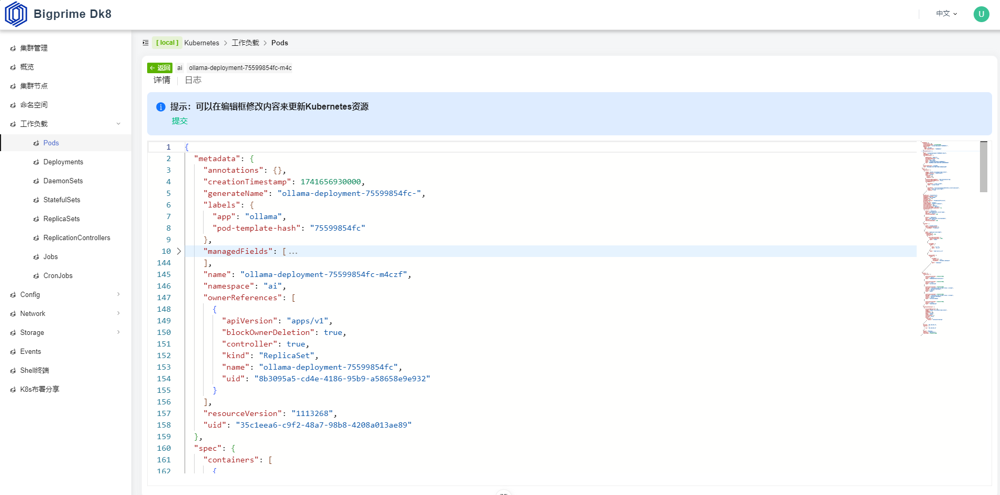

# Bigprime-Dk8 容器管理平台

​       bigprime-dk8是是 Bigprime DGP 大数据治理平台中的一个核心子平台，是一款基于java开发的Kubernetes管理平台，目标是让运维人员或开发人员能通过可视化的界面来操作kubernetes以及分享使用k8s来布署常用大数据的应用。

## 功能及特点：

- 可视化集群管理（支持多集群）

- 实时监控资源（Pod、Service、Deployment等）

- 内置集群终端直接操作kubernetes

- 资源的可视化的创建、修改、删除等操作

- 布署分享(分享常用的应用布署经验)

  

## 技术选型：

后端技术：

- **Spring Boot：** 用于快速构建独立的、生产级别的Spring应用程序，提供了丰富的内置功能，简化了配置和开发过程。
- **Spring Cloud：** 提供了微服务架构的完整解决方案，包括服务发现、配置管理、负载均衡等，提高了系统的可靠性和可扩展性。
- **Nacos：** 作为服务发现和配置中心，为微服务架构提供了动态的服务管理和配置更新能力。
- **easy-query：** 简化了数据库查询操作，提供了便捷的查询构建和执行功能，支持强类型对象关系查询和强类型SQL语法查询的ORM,拥有对象模型筛选、隐式子查询、隐式join、显式子查询、显式join。
- **Hutool：** 一个Java工具类库，提供了丰富的常用工具类，简化了开发过程中的重复代码。
- **Maven：** 作为项目构建工具，提供了依赖管理和构建自动化的功能，提高了开发效率。	
- 使用Jdk11版本

前端技术：

- **Vue3：** 作为前端框架，提供了更高效的响应式机制和更好的性能表现，支持组件化开发，提高了代码的可复用性和可维护性。
- **Opentiny：** 一个轻量级的前端UI框架，提供了丰富的组件和样式，简化了UI开发过程。
- **Pinia：** 作为Vue的状态管理库，提供了简洁易用的API，提高了状态管理的效率和可维护性。
- **vue-router：** 用于前端路由管理，支持页面跳转和组件懒加载，提高了用户体验。
- **TypeScript：** 作为JavaScript的超集，提供了静态类型检查和强大的类型系统，提高了代码的可读性和健壮性。
- **Vite：** 作为前端构建工具，提供了极快的构建速度和友好的开发体验，支持热模块替换和按需加载。

产品效果图：





##  快速开始

### 启动项目

**启动后端**

- 初始化数据库
- **启动Web服务：** 运行 `Dk8Application.java`

**启动前端**

- **bigprime-dk8-ui项目默认会初始化执行环境**

  - 默认安装版本**node版本v21.6.2**，**npm版本10.5.0**，在bigprime-ui项目pom.xml中可进行修改

- **启动前端服务：**

  ```
  npm run dev
  ```

### 1、集群管理

​         通过.kube/config来连接kubernetes集群，实现多集群管理，集群切换


### 2、集群节点管理

​       管理查看集群节点的状态，以及节点常的污点、节点驱逐等功能


### 3、命名空间

​       集群命名空间管理，命名空间的创建、查看、状态等


### 4、Workload-> Pod

​       管理集群中Pod的创建、修改、查询、删除、日志、运行指标等


提供创建Pod模板


查看并修改Pod


### 5、Workload->Deployment

管理集群中Deployment控制器的创建、修改、删除


### 6、Workload->DaemonSet

管理集群中DaemonSet控制器的创建、修改、删除


### 7、Config -> ConfigMap

管理集群中ConfigMap的创建、修改、删除


### 8、Config->Secret

管理集群中Secret的创建、修改、删除


### 9、Network->Service

管理集群中Servcie的创建、修改、删除


### 10、Storage->StorageClass

管理集群中StorageClass的创建、修改、删除


### 11、Events

查看集群中的Event


### 12、Shell终端

提供连接集群的web终端，在终端可以直接操作k8s的命令


### 13、布署分享

提供常用的布署分享，避开外网网络问题


## 欢迎交流
- **欢迎您加入社区交流分享**
  - **微信交流群**
  

  - **QQ交流群：**
  